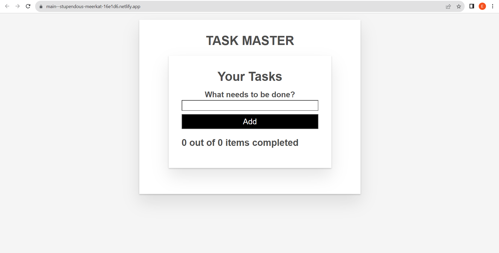
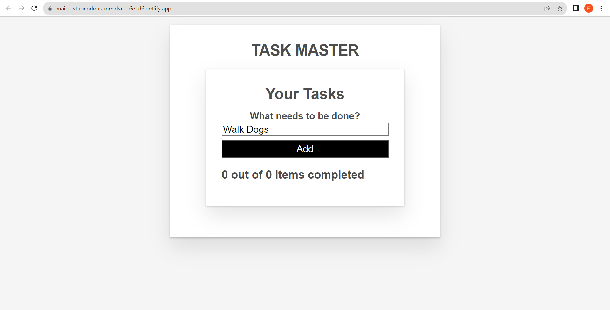
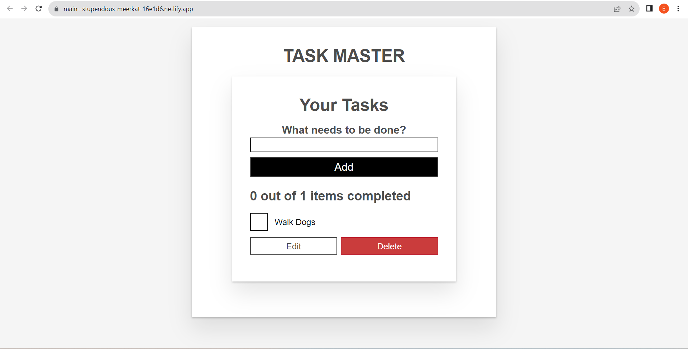
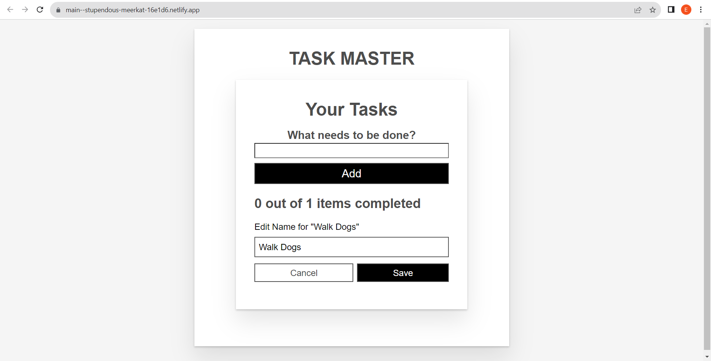
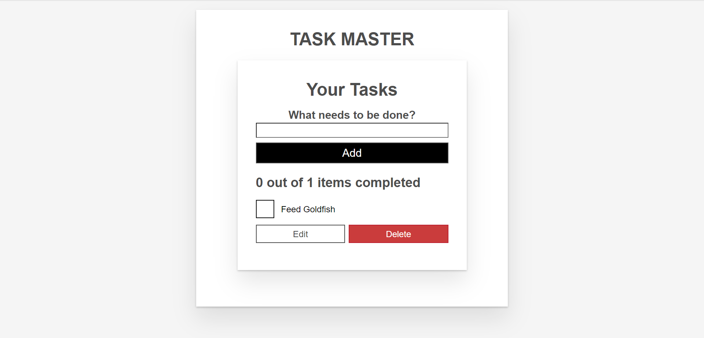

# Task Master

Task Master is a task management app that allows users to create, edit, and delete tasks. Users can also mark tasks as completed. It is heavily inspired by the default Vue To-Do List project that every new Vue developer experiences making, as they begin to become accustomed to the framework. This approach involves implimenting a local browser data base (IndexedDB) to save task objects to your local broswer's storage, so that you can mantain your personal tasks on your device's browser. This project took me 3 days to complete, which in all those 3 days, exposing me to the Vue framework for the first time and using my new software engineering skills to adapt and master as much as I could to create said project to prove that my fundimental understanding of the JavaScript framework is experienced enough to take on any new challenge and overcome it with enough hard work and dedication.

## Screenshots

Landing page every user is greeted to

Simply enter any task you need to get done

Then click the "Add" button, and then your new task will be listed

If you ever need to edit your task, for what ever reason, simply click on the "Edit" button

Enter the new title of your task, click save, and BAAM! Your task is now updated with a new title

Once you have achieved your task, you can simply click on the checkbox to mark your task as complete

Once you no longer need your task being displayed, you can simply click on the "Delete" button, and like that, your task is gone

## Technologies Used

- Vue
- Vite
- CSS
- JavaScript
- IndexedDB
- Netlify

## Getting Started 

- [Deployed App](https://main--stupendous-meerkat-16e1d6.netlify.app/)
Click on the link and start listing your tasks!
- Trello Board - Coming Soon!

# Vue 3 + Vite

This template should help get you started developing with Vue 3 in Vite. The template uses Vue 3 `<script setup>` SFCs, check out the [script setup docs](https://v3.vuejs.org/api/sfc-script-setup.html#sfc-script-setup) to learn more.

## Recommended IDE Setup

- [VS Code](https://code.visualstudio.com/) + [Volar](https://marketplace.visualstudio.com/items?itemName=Vue.volar) (and disable Vetur) + [TypeScript Vue Plugin (Volar)](https://marketplace.visualstudio.com/items?itemName=Vue.vscode-typescript-vue-plugin).

## SHOUTOUTS

- Mozilla (https://developer.mozilla.org/)
- Evan Do Carmo

## Next Steps

Some planned future enhancements:

- Implement user accounts 
- Add due dates and reminders
- Integrate calendar view
- Enable drag and drop task reordering
- Add task labels and filtering
- Improve responsive design

Let me know if you would like me to modify or expand the readme file in any way!